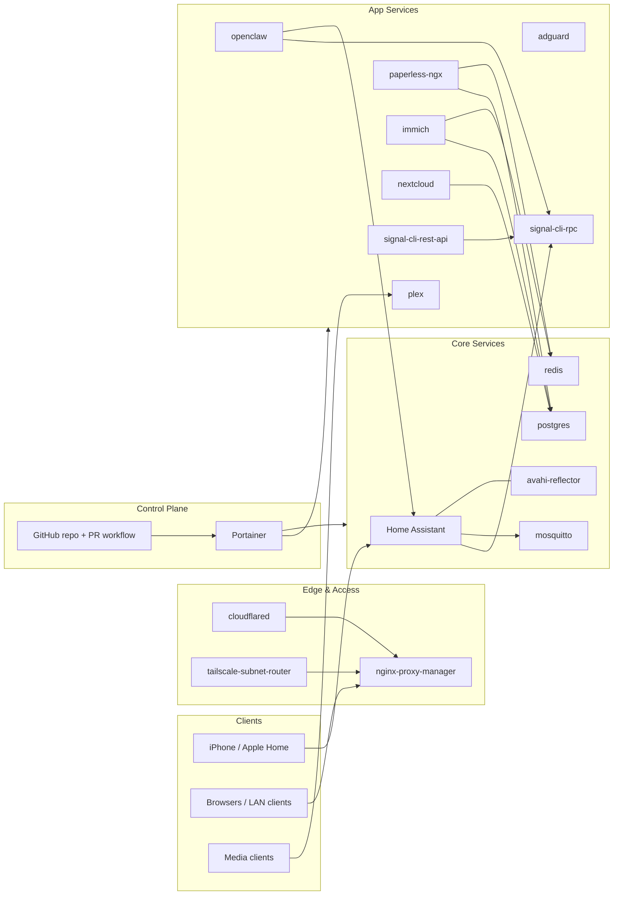

# lan-infra

Infrastructure services for home/lab workloads managed with Docker Compose + Portainer + GitOps.

## Architecture (high-level)

## Notes

- This diagram is intentionally high-level, not an exhaustive dependency graph.
- HomeKit bridge mode relies on:
  - published HomeKit ports in `services/home-assistant/compose.yaml`
  - `avahi-reflector` for mDNS reflection in network-isolated setups
